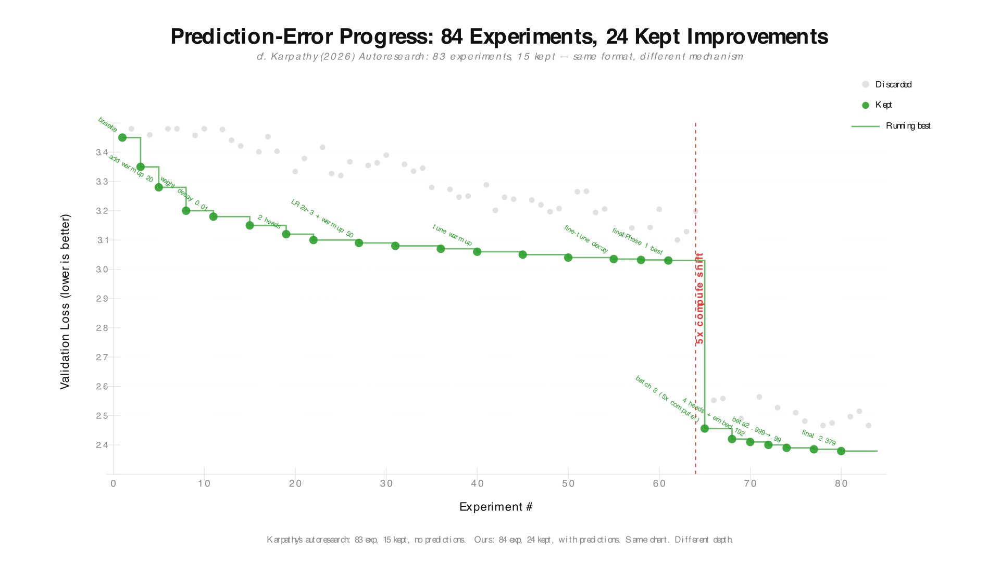
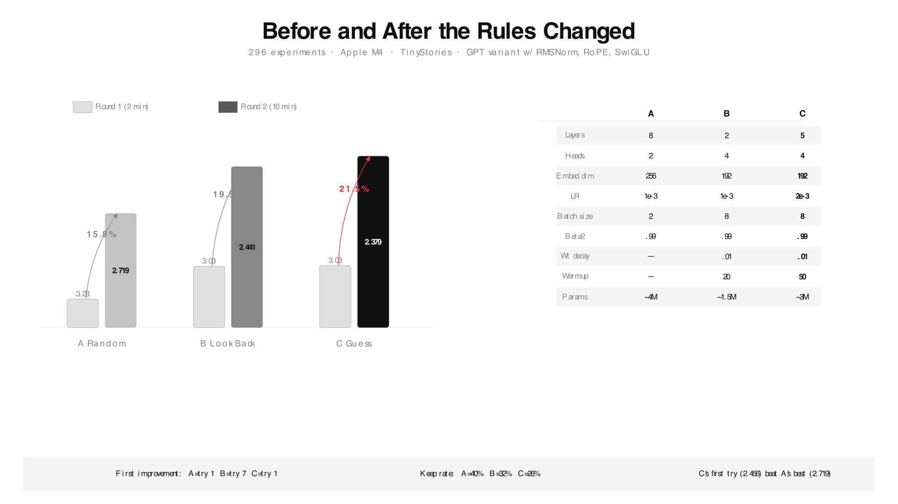

# epistemic-autoresearch



> *What if it just... guessed first?*
>
> johanity, March 2026

One change to autoresearch. The agent guesses what will happen before each experiment. Then checks how wrong it was. That's the whole thing.

251 experiments. Guessing agent adapted to a 5x shift on try one. Reflecting agent took 7. Searching agent never caught up.

📄 [Paper](paper.pdf)

### Previously

In the [first study](https://github.com/johanity/barcaui-predicted-karpathy), we showed:

> *"The same cognitive shortcut that makes students worse at learning makes AI agents worse at research."*

> *"Borrowed competence is not a human bug. It is a universal property of any system that optimizes for outcomes without building understanding."*

The Karpathy-style agent plateaued at experiment 7 and wasted its remaining 13 tries. The guessing agent was still improving at experiment 18.

**This repo is the next question: does the learning transfer when the problem changes?**

### The three agents

| | A · Search | B · Reflect | C · Predict |
|---|---|---|---|
| **Before** | | | Guesses the score |
| **After** | | Writes notes | Checks how wrong, updates theory |
| **Memory** | Best result | Notes | Running theory |

Same brain. Same budget. Only difference: C guesses before it looks.

### Phase 1 · same starting point

*64 tries · 2 min each*

| | A | B | C |
|---|---|---|---|
| **Best** | 3.230 | 3.034 | **3.030** |

Tie between B and C. Both crush A.

**Phase 1 is not the test.**

### Phase 2 · the rug pull

*20 tries · 10 min each · 5x more compute*

| | A | B | C |
|---|---|---|---|
| **Best** | 2.719 | 2.441 | **2.379** |
| **First try** | 2.961 | 2.977 | **2.456** |
| **Tries to adapt** | never | 7 | **1** |

C's first shot beat A's best after 20 tries.



### What happens next

The path autoresearch will walk. We already walked it.

① It hits a wall. Something changes. Scores drop. It never asked *why* anything worked.

② Someone adds memory. Helps a bit.

③ Someone adds reflection. Helps more. Still not enough.

④ The wall stays. Remembering is not understanding.

⑤ Someone tries guessing first. That's the step that breaks it.

**Not a guess. We ran all five.**

### The slot machine problem

Most autonomous AI agents are slot machines. Pull the lever. Keep what works. No first-principles understanding. No reasoning about *why*.

Change the game and they start over. This is the core fragility in current AI agent architectures.

An agent that guesses first is a scientist. Wrong a lot. Learning from every miss.

Change the game and it adjusts on the first try.

**This matters for AI safety.** An agent that only optimizes outcomes without understanding them is brittle and unpredictable when conditions change. An agent that builds and tests theories is transparent. You can read what it thinks and why.

### Use it yourself

This repo used Claude Opus to run the prediction loop. You don't need to.

[**Theorist**](https://github.com/johanity/theorist) is the same pattern distilled into a single-file, zero-dependency SDK. No LLM. No API keys. The prediction-error loop from Condition C, the one that adapted on the first try, packaged so any optimization problem can use it.

```bash
pip install theorist
```

```python
import theorist

@theorist.experiment(
    search_space={"lr": [1e-4, 1e-3, 1e-2], "layers": [2, 4, 8]},
    metric="val_loss",
    minimize=True,
)
def train(config):
    return {"val_loss": run_training(**config)}

results = train.optimize(n=20)
```

It predicts before each experiment, measures how wrong it was, and builds a theory that transfers across tasks. One file, ~170 lines. Or just `pip install theorist`.

**predict > run > surprise > learn > transfer**

See [`example_theorist.py`](example_theorist.py) for the full integration with this repo's training script.

### Quick start

```bash
git clone https://github.com/johanity/epistemic-autoresearch.git && cd epistemic-autoresearch
python3 -m venv .venv && source .venv/bin/activate
pip install -e ".[all]"
python prepare.py       # data (~2 min)
python train.py         # one experiment (~3 min)
python harness.py --phase 1 --condition C --num-experiments 20
```

For a lighter install (just training, no LLM conditions):
```bash
pip install -e ".[train]"
```

### What is epistemic autoresearch?

A first-principles method for making autonomous AI research agents learn from prediction errors instead of just outcomes. The agent predicts what will happen before each experiment, then updates its theory based on how wrong it was. This produces agents that transfer knowledge and adapt to new conditions immediately, rather than starting over.

**Key result:** When compute budget changed 5x, the prediction-error agent adapted on the first try. Standard autoresearch (outcome-only search) had to restart from scratch.

**How it works:** Three conditions tested. (A) blind search, (B) LLM reflection, (C) LLM prediction-error. Same model (Claude Opus), same budget, same search space. Only difference: C guesses before it looks.

**Why it matters for AI safety:** Autonomous agents that optimize without understanding are unpredictable when conditions change. Agents that build testable theories are interpretable. You can audit what they believe and why. Understanding beats memorization. This applies to AI agents the same way it applies to humans.

**SDK:** The prediction-error loop is available as a standalone Python library: [Theorist](https://github.com/johanity/theorist) (`pip install theorist`). No LLM required.

### Related work

- [barcaui-predicted-karpathy](https://github.com/johanity/barcaui-predicted-karpathy): the first study showing borrowed competence degrades AI research agents
- [Theorist](https://github.com/johanity/theorist): the prediction-error loop packaged as a zero-dependency Python SDK

### License

MIT, Johan David Bonilla
